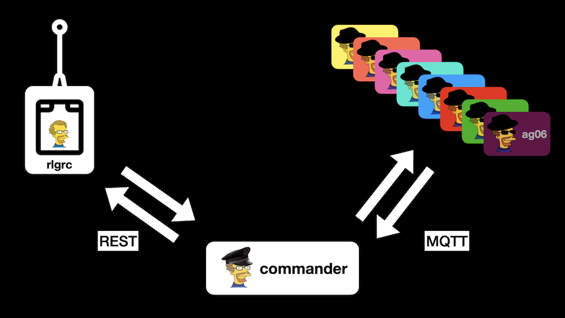

RLG Commander
=============

---
# Preface
The purpose of the **RLGS** (Real Life Gaming System) is to realize games for **tactical sports** like paintball, airsoft, Nerf or Laser Tag. RLGS adapts well known multiplayer modes from games like Battlefield, Call of Duty, FarCry, Planetside 2 oder Counterstrike to be played in real life.

The RLGS concept consists of two basic elements: the commander (this project) and one or more [agents](https://github.com/tloehr/rlgagent)

Agents can produce optical and acoustical signals and detect events (currently only the press of a button). They do **not know anything** about why they are flashing LEDs, sounding sirens or why somebody presses their buttons. They completely rely on the commander to tell them what to do. The commander is the only one who keeps track about the game situation.

The commander communicates with the agent via the MQTT protocol. Itself is remote controlled ([rlgrc](https://github.com/tloehr/rlgrc)) via REST.

# Main Releases
* pre 1.1 - development versions never used in RL
* 1.1 First version to run on a real paintball field. BF Conquest only.
* 1.2 Added FarCry Assault.
* 1.3 Redesign of spawn agent concept

